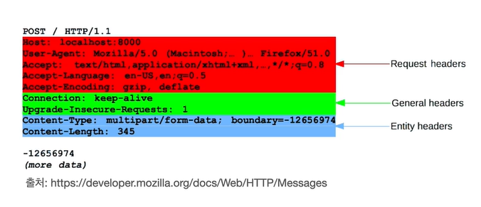
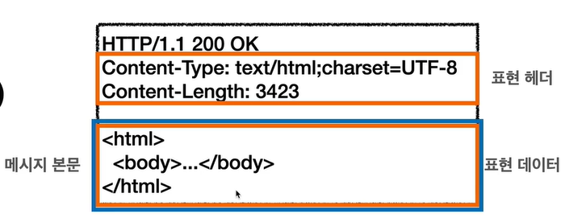

# HTTP 헤더 
 - 개요 : 헤더필드 : 필드내임 (필드네임은 대소무낮 구분 없음)
 - 용도 :
   - HTTP 전송에 필요한 모든 부가정보
   - 예) 메세지 바디의 내용, 바디의 크기, 인증, 서버정도, 캐시관리 등등...
   - 필요 시 임의의 헤더 추가 가능
   
   

       
     

     
 - 헤더의 종류 (RFC 2616 - 과거)
   - General 헤더 : 메세지 전체에 적용되는 정보
   - Request 헤더 : 요청 정보
   - Response 헤더 : 응답 정보
   - Entity 헤더 : 엔티티 바디 정보
 
 - RFC 7230 - 최신
   - 엔티티 -> 표현
   - 표현 : 표현 메타데이터 + 표현데이터
   
 - HTTP BODY
   - message body - RFC7230  
   
    

          
        

        
      - 메세지 본문을 통해 표현 데이터 전달
      - 메세지 본문  = 페이로드
      - 표현은 요청이나 응답에서 전달할 실제 데이터
      - 표현 헤더는 표현 데이터를 해석할 수 있는 정보 제공
        - 데이터 유형 (HTML, json), 데이터 길이, 압축 정보 등등
      

## 일반헤더
