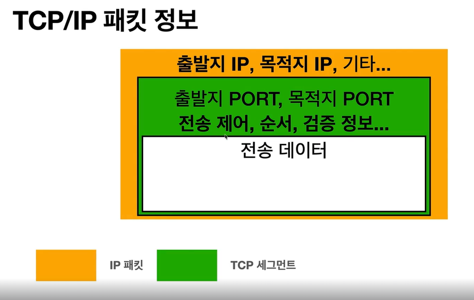

# IP (인터넷 프로토콜 역할)
- 지정한 IP 주소에 데이터 전다
- 패킷 이라는 통신 단위로 데이터 전달

## IP 패킷 정보
- 출발지 IP, 목적지IP, 기타..

## IP 프로토콜의 한계
 비연결성
 - 패킷을 받으 대상이 없거나 서비스 불능 상태여도 패킷 전송

  비신뢰성
 - 중간에 패킷이 사라지면?
 - 패킷이 순서대로 안오면?

 프로그램 구분
 - 같은 IP를 사용하는 서버에서 통신하는 애플리케이션이 둘 이상이면?
 
#TCP/UDP 의 등장.
 
#TCP/UDP

# TCP 특징(전송 제어 프로토콜)
- 연결 지향 - tcp 3 way handshake
- 데이터 전달 보증
- 순서 보장
- 신뢰할 수 있는 프로토콜
- 현재는 대부분 TCP 사용

# TCP/IP 패킷 정보

#UDP 특징(사용자 데이터그램 프로토콜)

- 하얀 도화지에 비유(기능이 거의 없음)
- 연결지향 X
- 데이터 전달 보증 X
- 순서 보장 X
- 단순하고 빠름
- 정리
  - IP와 거의 같다 (PORT, 체크섬 정도만 추가)
  - 애플리케이션에서 추가 작업 필요
  
# PORT
  - 같은 IP 내에서 프로세스 구분
  - 0~65535 할당가능
    - 0~1023 : 잘 알려진 포트, 사용하지 않는 것이 좋음
    - FTP - 20,21
    - TELNET - 23
    - HTTP - 80
    - HTTPS - 443
    
    
# DNS (도메인 네임 시스템) - > IP 는 변경될 수 있다.
  - 전화번호부
  - 도메인 명을 IP 주소로 변환
  - 도메인 명을 DNS 서버에 등록 > 도메인을 통해 IP 주소 찾기
  
  
#인터넷 네트워크 정리
  - 인터넷 통신
  - IP 
  - TCP/UDP
  - PORT
  - DNS
  
  
