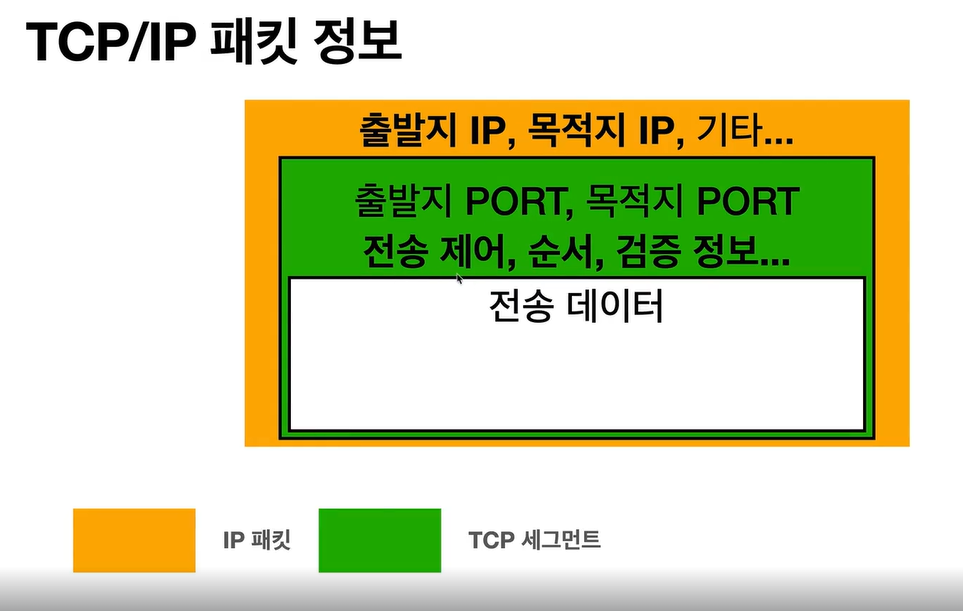

#TCP/UDP

# TCP 특징(전송 제어 프로토콜)
- 연결 지향 - tcp 3 way handshake
- 데이터 전달 보증
- 순서 보장
- 신뢰할 수 있는 프로토콜
- 현재는 대부분 TCP 사용

# TCP/IP 패킷 정보

#UDP 특징(사용자 데이터그램 프로토콜)

- 하얀 도화지에 비유(기능이 거의 없음)
- 연결지향 X
- 데이터 전달 보증 X
- 순서 보장 X
- 단순하고 빠름
- 정리
  - IP와 거의 같다 (PORT, 체크섬 정도만 추가)
  - 애플리케이션에서 추가 작업 필요
  
  # PORT
  - 같은 IP 내에서 프로세스 구분
  - 0~65535 할당가능
    - 0~1023 : 잘 알려진 포트, 사용하지 않는 것이 좋음
    - FTP - 20,21
    - TELNET - 23
    - HTTP - 80
    - HTTPS - 443