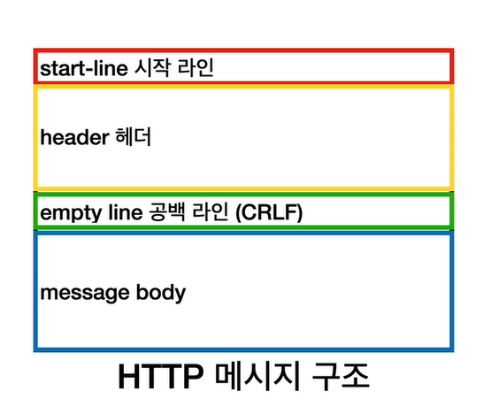
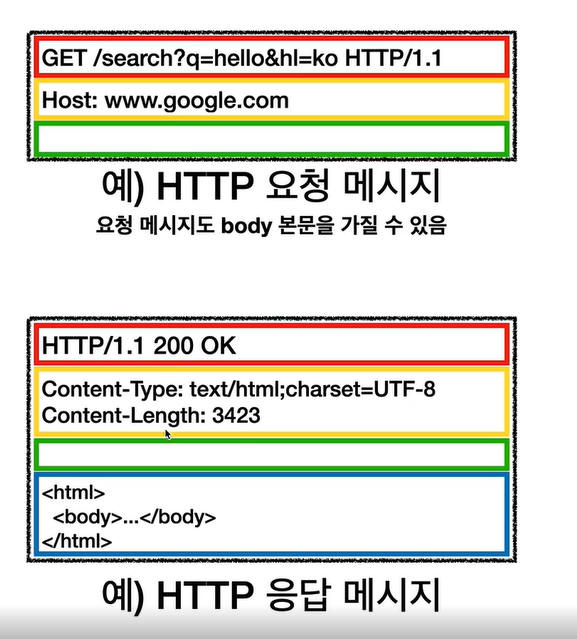

# URI (Uniform Resource Identifier)
## URI vs URL vs URN
- URI : URL(Locator) + URN(Name)
  - URL : 리소스가 있는 위치를 지정
  - URN : 리소스에 이름을 부여
  - 위치는 변할 수 있지만, 이름은 변하지 않는다.
  - 현재 이름만으로 실제 리소스를 찾을 수 있는 방법이 보편화 되지 않음.

- Uniform : 리소스 식별하는 통일된 방식
- Resource : 자원, URI로 식별할 수 있는 모든 것(제한 없음)
- Identifier : 다른 항목과 구분하는데 필요한 정보

# Web 브라우저 요청 흐름

  

- 웹 브라우저가 HTTP 메세지 생성
- TCP/IP 연결 (IP.PORT)
- TCP?IP 패킷 생성, HTTP 메세지 포함
 

- 요청 패킷 목적지로 전달 (다양한 노드들을 통해) > HTTP 응답 메세지 생성
- 요청한 쪽으로 메세지 전달 > 웹 브라우저 렌더링

# HTTP

## 기반 프로토콜
- TCP : HTTP/1.1(주된) , HTTP/2
- UDP : HTTP3

## 특징
- 모든것이 HTTP : 
  - HTML, 음성, 영상, 이미지, JSON 등 거의 모든 형태의 데이터 전송 가능

- 클라이언트 서버 구조 : Request Response 구조
  - 클라이언트 : 요청 보내고, 어떻게 그릴지
  - 서버 : 오는 요청 처리에 대한 트래픽과 아키텍처 구조등 비지니스 로직에 집중한 개발
  
- stateless (무상태) : 
  - Stateful : 상태 유지 (요청에 대해 상태유지) 
     - 항상 상태를 저장하기 위해서 같은 서버(점원)가 있어야 하고
     - 증설하기 어려우며 
     - 자원이 많이 필요
    
  - Stateless : 무상태 (요청에 대한 상태유지를 하지 않음)
    - 상태를 유지하지 않아도 되기때문에 서버(점원)가 같을 필요가 없고
    - 서버 증설이 쉬우며 (스케일 아웃 - 수평 확장 유리)
    - 자원이 적게 소모
    - 한계 : 단순한 서비스 소개 등은 무상태로 설계 가능하나, 
     로그인 등 상태를 유지해야 할 경우 세션등을 통해 상태를 유지하도록 설계를 해야 한다.
    
- 비 연결성 : 
  - HTTP 는 기본적으로 연결을 유지하지 않는 모델
  - 일반적으로 초 단위 이하의 빠른 속도로 응답
  - 1시간 동안 수천명이 서비스를 사용해도 실제 서버에서 동시에 처리하는 요청은 수십개 이하로 매우 작음
    - 예) 웹 브라우저에서 계속해서 검색 버튼을 누르지는 않는다.
  - 서버 자원을 매우 효율 적으로 사용할 수 있음
  - 단점 : 
    - TCP/IP 의 새로운 연결로 3wayhandshake 시간증가 > HTML, css, 이미지 등 수 많은 자원 다운로드
    - 지금은 HTTP 지속 연결(Persistent Connections)로 문제 해결
    - HTTP/3 에서는 UDP 연결등으로 더욱 최적회
    
- HTTP 메세지 :

  - 구조 
  

    
  

   
  

    
  

  
  - 시작라인(StartLine)
    - 요청 메세지 : HTTP메소드, 요청대상(절대경로= '/'로 시작하는 경로) , HTTP버전
    - 응답 메세지 : HTTP 버전, SP(공백), HTTP status 코드, SP(공백), reason-phrase(사람이 이해할 수 있는 짧은 코드) CRLF
 
  - 헤더
    - 필드네임: 밸류
    - HTTP 전송에 필요한 모든 부가 정보가 포함 되어 있음
    
  - HTTP 메세지 바디
    - 실제 전송할 데이터
    - HTML 문서, 이미지, 영상, JSON 등 byte로 표현할 수 있는 모든 데이터 전송 가능
    
 ## HTTP 정리
  - 단순 하고, 쉽게 확장 가능 하다.
  
## HTTP 메서드

 - 리소스와 행위를 분리
   - URI는 리소스만 식별
     - 리소스 : 회원
     - 행위 : 조회, 등록, 삭제, 변경
   - 리소스는 명사, 행위는 동사
   - 행위(메서드)는 어떻게 구분?
   
  - HTTP 메서드 - GET, POST, PUT, PATCH, DELETE
    - GET: 리소스 조회
      - 서버에 전달하고 싶은 데이터는 query(쿼리 파라미터, 쿼리 스트링)을 통해서 전달
      - 메세지 바디를 사용해서 전달할 수 있지만, 지원하지 않는 곳이 많아서 권장하진 않음
      
    - POST: 요청 데이터 처리, 주로 등록에 사용
      - 의미 : POST 메서드는 대상 리소스가 리소스의 고유한 의미 체계에 따라 요청에 포함 된 표현을 처리하도록 요청한다.
        - 1 새 리소스 생성(등록)
        - 2 요청 데이터 처리 (주문 > 결제완료 > 배달시작 > 배달완료) 처럼 단순히 값 변경을 넘어 프로세스의 상태가 변경되는 경우
        - 3 다른 메서드로 처리하기 애매한 경우 
          - JSON 으로 조회 데이터를 넘겨야 하는데, GET 메소드를 사용하기 어려운 경우
          - 애매하면 POST
      - 메세지 바디를 통해서 서버로 요청 데이터 전달
      - 서버는 요청 데이터 처리
        -메세지 바디를 통해 들어온 데이터를 처리하는 모든 기능을 수행한다.
      - 주로 전달된 데이터로 신규 리소스 등록, 프로세스 처리에 사용
      
    - PUT: 리소스를 "완전히" 대체, 해당 리소스가 없으면 생성
      - 리소스 자체를 대체
        - 리소스가 있으면 대체, 없으면 생성 > 쉽게 이야기 해서 새로 덮어 버림
      - **중요 클라이언트가 리소스를 식별
        - 클라이언트가 리소스의 정확한 위치를 알고 URI 지정
        - POST 요청과의 차이점
        
    - PATCH: 리소스를 부분 적으로 변경
      - 리소스 부분 변경 (수정)
      - 간혹 지원하지 않는 경우가 있을 수 있으나 그럴 때에는 POST 를 통해 요청
      
    - DELETE: 리소스 삭제
      - 해당 리소스 삭제
      
    - 기타 : HEAD,OPTIONS,CONNECT,TRACE... etc
    
 ## HTTP 메서드 속성
 
  - 안전
    - 호출해도 리소스를 변경하지 않는다.
    
  - 먹등
    - 한 번 호출하든 여러 번 호출하든 결과가 똑같다.
    - 왜 멱등? : 자동 복구 메커니즘 -> 서버가 TIMEOUT 등으로 응답이 없을 때 같은 요청을 다시 한다.
    - 멱등 메서드 
      - GET, PUT, DELETE
    - 멱등 메서드 아님
      - POST
      
  - 캐시가능
    - 응답 결과 리소르를 캐시해서 사용해도 되는가?
    - GET, HEAD, POST, PATCH 캐시 가능
    - 그러나 실제로는 GET, HEAD 정도만 캐시로 사용
      - POST, PATCH는 본문 내용까지 캐시 키로 고려해야 하는데, 구현이 쉽지 않음
  
  

