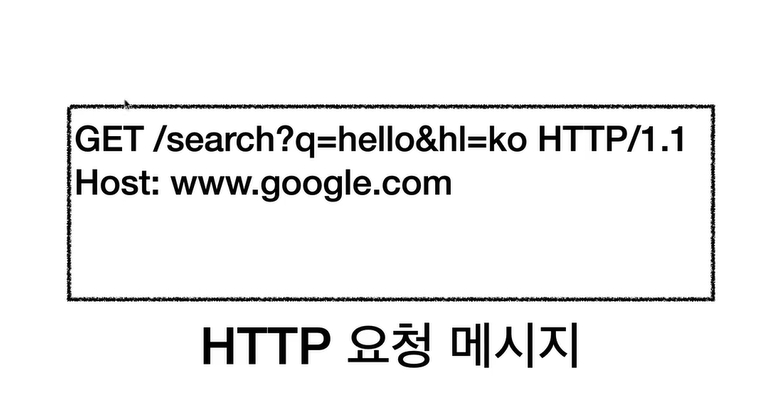
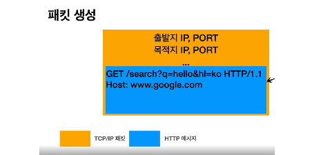
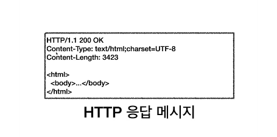

# URI (Uniform Resource Identifier)
## URI vs URL vs URN
- URI : URL(Locator) + URN(Name)
  - URL : 리소스가 있는 위치를 지정
  - URN : 리소스에 이름을 부여
  - 위치는 변할 수 있지만, 이름은 변하지 않는다.
  - 현재 이름만으로 실제 리소스를 찾을 수 있는 방법이 보편화 되지 않음.

- Uniform : 리소스 식별하는 통일된 방식
- Resource : 자원, URI로 식별할 수 있는 모든 것(제한 없음)
- Identifier : 다른 항목과 구분하는데 필요한 정보

#Web 브라우저 요청 흐름

- 웹 브라우저가 HTTP 메세지 생성
- TCP/IP 연결 (IP.PORT)
- TCP?IP 패킷 생성, HTTP 메세지 포함
 

- 요청 패킷 목적지로 전달 (다양한 노드들을 통해) > HTTP 응답 메세지 생성
- 요청한 쪽으로 메세지 전달 > 웹 브라우저 렌더링
