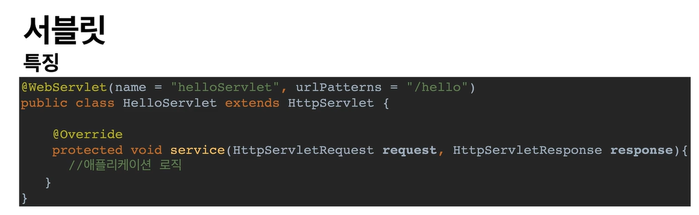

# 웹 애플리케이션 이해

## 서블릿

  

 - /hello 가 호출되면 해당 서블릿 코드가 실행
 - 요청정보를 쉽게 알 수있는 HttpServletRequest
 - 응답 정보를 쉽게 제공할 수 있는 HttpServletResponse
 - 개발자는 HTTP 스펙을 매우 편리하게 사용

## 서블릿 컨테이너
 - 톰캣처럼 서블릿을 지원하는 WAS 를 서블릿 컨테이너라고 함
 - 서블릿 컨테이너는 서블릿 객체를 생성, 초기화, 호출, 종료 하는 생명주기 관리
 - 서블릿 객체는 싱글톤으로 관리
   - 고객의 요청 시점 마다 계속 객체 생성하는 것은 비효율
   - 최초 로딩 시점에 서블릿 객체를 미르 만들어두고 재활용
   - 모든 고객 요청은 동일한 서블릿 객체 인스턴스에 접근
   - 공유 변수 사용 주의
   - 서블릿 컨테이너 종료 시 함께 종료
   
 - JSP도 서블릿으로 변환 되어 사용
 - 동시 요청을 위한 멀티 쓰레드 처리 지원
 
 ## 멀티 쓰레드
 
 ### 쓰레드
 - 애플리케이션 코드를 하나하나 순차적으로 실행하는 것은 쓰레드
 - 메인 메서드를 처음 실행하면 main 이라는 이름의 쓰레드가 살행
 - 쓰레드가 없다면 자바 애플리케이션 실행이 불가능
 - 쓰레드는 한번에 하나의 코드 라인만 수행
 - 동시 처리가 필요하면 쓰레드를 추가로 생성
 
 ### 요청마다 쓰레드 생성
 
  - 장점 
    - 동시 요청 처리 가능
    - 리소스(CPU,메모리)가 허용할 때 까지 처리가능
    - 하나의 쓰레드가 지연 되어도 나머지 쓰레드는 정상 동작
    
  - 단점
    - 쓰레드 생성 비용은 매우 비싸다
      - 고객 요청이 올 때 마다 생성하면 속도가 늦어진다.
      
    - 쓰레드는 컨텍스트 스위칭 비용이 발생한다.
    - 쓰레드 생성에 제한이 없다.
      - 고객 요청이 많으면, 리소스(CPU,메모리) 임계점이 넘어 서버가 죽을 수 있다.
 
 ### 쓰레드 풀
 ####요청 마다 쓰레드 생성의 단점 보완
 
 - 특징
   - 필요한 쓰레드를 쓰레드 풀에 보관하고 관리
   - 쓰레드 풀에 생성 가능한 쓰레드의 최대치를 관리한다. 톰캣은 기본적으로 200개 (변경 가능)
   
 - 사용
   - 쓰레드가 필요하면, 이미 생성되어 있는 쓰레드를 쓰레드 풀에서 꺼내서 사용한다.
   - 사용을 종료하면 쓰레드 풀에 해당 쓰레드를 반납한다.
   - 최대 쓰레드가 모두 사용중이면?
     - 기다리는 요청은 거절하거나 특정 숫자만큼만 대기하도록 설정 가능
     
 - 장점
   - 쓰레드가 미리 생성되어 있으므로, 쓰레드를 생성하고 종료하는 비용 절약, 응답 시간 빠름
   - 생성 가능한 쓰레드의 최대치가 있으므로 너무 많은 요청이 들어와도 기존 요청은 안전하게 처리할 수 있다.
   
 #### 실무 팁
 - WAS의 주요 튜닝 포인트는 최대 쓰레드(Max Thread) 수이다.
 
 - 이값을 너무 낮게 설정하면
   - 동시 요청이 많으면 서버 리소스는 여유롭지만 클라이언트는 응답 지연
  
 - 이 값을 너무 높게 설정하면
   - 리소스 임계점 초과로 서버 다운
   
 - 장애시?
   - 클라우드면 일단 서버부터 늘리고, 이후에 튜닝
   - 클라우드가 아니면 열심히 튜닝
   
 - 적정 숫자?
   - 애플리케이션 로직 복잡도, CPU, 메모리, IO 리소스 상황에 따라 다름
   - 성능 테스트
     - 최대한 실제 서비스와 유사하게 성능 테스트 시도
     - 툴 : 아파치 ab, 제이미터 등
     
 ### WAS 의 멀티 쓰레드 지원
 #### 핵심
 - 멀티 쓰레드에 대한 부분은 WAS 가 처리
 - 개발자가 멀티 쓰레드 관련 코드를 신경쓰지 않아도 됨
 - 개발자가 마치 싱글 쓰레드 프로그래밍을 하듯 개발하면 됨
 
 
 ### 정적 리소스 
 
 - 고정된 HTML 파일, CSS, JS, image
 
 ### HTTP API 
 
   - 다양한 시스템에서 호출
   - 데이터만 주고받음
   - 주로 JSON 형태로 데이터 통신
   
   - 서버 to 서버
     - 주문 서버 > 결제 서버
     
 ### SSR - 서버 사이드 렌더링
 
 - 서버에서 최종 HTML 을 생성해서 클라이언트에 전달
 - 주로 정적 화면에 사용
 - 관련기술 : JSP, 타임리프 - > 백엔드 개발자
 
 
 ### CSR - 클라이언트 사이드 렌더링
 
 - HTML 결과를 자바스크립트를 사용해 웹 브라우저에서 동적으로 생성해서 적용
 - 주로 동적 화면에 사용, 웹 환경을 마치 앱 처럼 필요한 부분부분 변경할 수 있음
 - 예) 구글 지도, Gmail, 구글 캘린더
 - 관련기술 : React, Vue.js -> 프론트 엔드 개발자